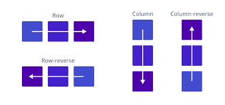
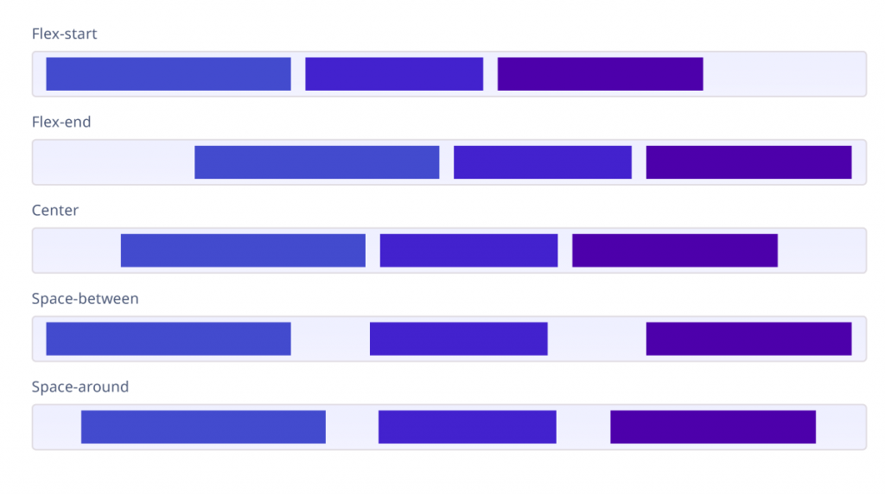
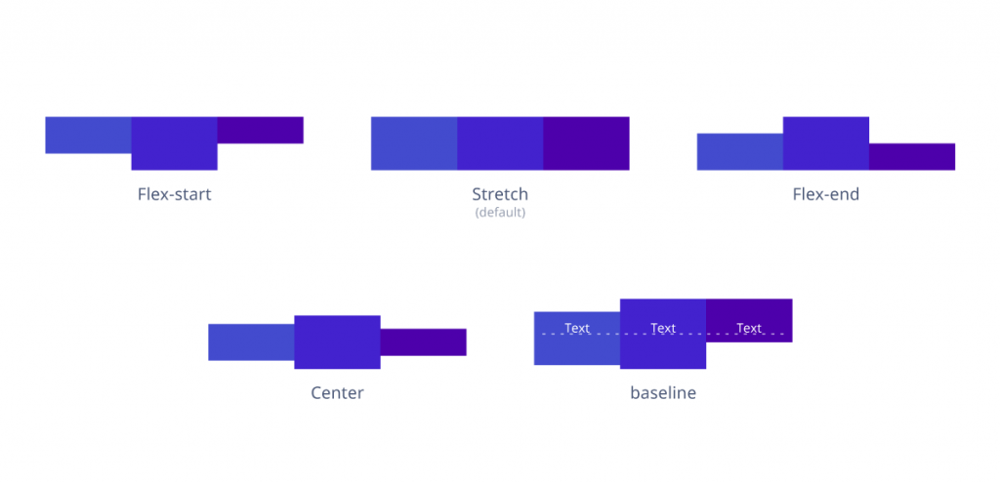

# Ultimate Flexbox

So, Why Flexbox? You may ask!
Well, for vertical centering, I may answer!

Can you do it easily? Vertically centering children!

Here's a way without flexbox:
```css
center {
    top: 50%;
    left: 50%;
    transform: translate(-50%, -50%);
}
```
The above methods works cause the property translate uses element's size, and not document's.
How do I know that? Oh, I found it somewhere sometime ago.

So, let's get back to:
1. Why flexbox? 
2. What it is? 
3. Terminology
4. How to use it?

## Why Flexbox?

The first one I'd like to say is that it's really, really easy to use and very faithful.
It will make sure, it doesn't do anything stupid!

It's supported well in Cross Browsers
- Chrome 29+
- Firefox 28+
- Internet Explorer 11+
- Opera 17+
- Safari 6.1+ (prefixed with -webkit-)
- Android 4.4+
- iOS 7.1+ (prefixed with -webkit-)

### Why use it?

Well, MDN says:

- Vertically centering a block of content inside its parent.
- Making all the children of a container take up an equal amount of the available width/height, regardless of how much width/height is available.
- Making all columns in a multiple column layout adopt the same height even if they contain a different amount of content.

You'll see just in a few minutes, And I swear when you've learned it! Your life will become much easier as a Frontend Dev.

Let's Begin!

## What is it, this flexbox thing?

Flexbox is a CSS module(or tool) that only helps you in laying out 2D structures easily and with simplicity.

Average Joe: _yells_ **Only 2D won't help me!** _closes the tab_.

Don't be him! Instead, Listen to me and learn flexbox!

Flexbox have row and column properties, which helps you select inline or block directions(As defined in Document Flow).

They have `justify-items` and `align-items` properties which aligns items across different axis, and with different configs.

I'm in total love with flexbox, I've started using it everywhere, I use it wherever I can, It's made by Heaven's for us devs.

## Terminology

Let's show some good use cases and common terminology.

Do remember many of flexbox properties are meant to be set on the parent and some for children.

- **Parent & Children**: To make an element flex container, apply `display: flex` to it.
Any children that this container has, will now be called `flex-items`.
- **Main Axis**: Main axis of a flex box is the axis along which the items are laid, as we saw earlier that flexbox is 2D. It depends on the `flex-direction` property.
- **Cross Axis**: The axis perpendicular to the main axis, i.e, 90 deg to the main axis. This axis depends on the main axis for its direction.
- **Width & Height**: The width and height of a flex container are simply set by `width` and `height` css props on the flexbox.

That's almost it for terminology, Let's see how its used, shall we?

---
## How to use it?

We have to break the usage section down in two parts as some properties are meant to be applied on the parent and some are for children.

### Properties for Parent, i.e, Using Flexbox Part-1
All these properties needs to be applied to the parent, flexbox that is.
We saw above how to make a container a flexbox by applying `display: flex` to it!
It's children are then, by default flex-items.

#### flex-direction
This property defines the direction of the main-axis. It is the axis along which all the children will be laid out according to the configurations provided through other props.
`flex-direction: row | column | row-reverse | column-reverse`



- **row**: This is the default flex-direction. It lays children from left to right in _ltr_ and inverse in _rtl_.
- **column**: Lays children from top to bottom.
- **row-reverse**: This lays children from right to left in _ltr_ and inverse in _rtl_.
- **column-reverse**: Lays children from bottom to top.
 
#### justify-content
This defines the alignment of children along the main axis. There are several values and can be used as:
`justify-content: flex-start | flex-end | center | space-between | space-around | space-evenly`

These are the most used properties, there are some others like `start | end | left | right ... + safe | unsafe`, to know more about them head over [here](https://developer.mozilla.org/en-US/docs/Web/CSS/justify-content).



- **flex-start**: Items are towards the start of the flex-box along the main axis i.e, `flex-direction`.
- **flex-end**: Items are towards the end of the flex-box along the main axis i.e, `flex-direction`.
- **center**: Items are centered along the main-axis i.e, `flex-direction`.
- **space-between**: The total space is divided such that first and last element are on the start and the end of the box, others have space evenly distributed between them, all along the main axis.(More clear in image.)
- **space-around**: All items have 1 unit of space around them, which makes space between any two children 2 units. And 1 unit of space between edge of container and (first, last) child.

The image above makes these props way easier to understand. Don't worry we'lll cover them all, practically, with tutorials and examples in the end.

#### align-items 
This defines the alignment of children along the cross axis. There are several values and can be used as:
`align-items: flex-start | flex-end | center | stretch | baseline`

Align Items works on the current line. As per my understanding this applies to items in a single row. It'll take all the rows together and align them as you asked to.

Again there are other values, but these are most used once.(Google them later on!)



- **flex-start**: Items are aligned at the start of the cross-axis i.e, perpendicular to `flex-direction`.
- **flex-end**: Items are aligned at the end of the cross-axis i.e, perpendicular to `flex-direction`.
- **center**: Items are aligned at the center of the cross-axis.
- **stretch**: Items stretch to fill the container along the cross axis! (But they still remember the min & max-height.)
- **baseline**: Items are aligned in a way so that their baselines aligned along the cross-axis. Baseline is the line at which the text is aligned. <u>The line below this can be taken as baseline.</u>.

Again, the image makes it a lot easier to understand.

#### align-content
Similar to `justify-content` property, but this one works along the cross axis.
`align-content: flex-start | flex-end | center | space-between | space-around | space-evenly | stretch`

**Note**: This property has no effect when there is only one line of flex items. (Just for understading purposes) Cause it takes a row as a child and then behaves the same as `justify-content`.

Please, Google other values, if you need to. I really love this one picture for align-content by [CSS-Tricks](https://css-tricks.com/snippets/css/a-guide-to-flexbox/).


- **flex-start**: Rows are towards the start of the flex-box along the cross axis.
- **flex-end**: Rows are towards the end of the flex-box along the cross axis.
- **center**: Rows are centered along the cross-axis.
- **space-between**: The total space is divided such that first and last row are on the start and the end of the box, others have space evenly distributed between them, all along the cross axis.(More clear in image.)
- **space-around**: All rows have 1 unit of space around them, which makes space between any two rows 2 units. And 1 unit of space between edge of container and (first, last) row.
- **stretch**: Rows are strecthed to fill the whole space container has along the cross axis.(Clear in the picture!)

#### flex-wrap


